#Java basic

**Topic**

---
**Index**

1.Introduction of java

2.Operators & Variables

3.Data Types

4.Loops

5.Conditions

6.Statements

7.Function

8.String

9.Array

10.File Handing

11.Exception

12.Recurion
***
`Introduction` in java
```
Java is class-based Object-Oriented Programming language and 

is designed to have as few Impelimention Dependencies as Possible 
```

About of ```Java JDK, JRE and JVM``` 
```
JVM (Java Virtual Machine) is an abstract 
machine that enables your computer to run a Java program.
```

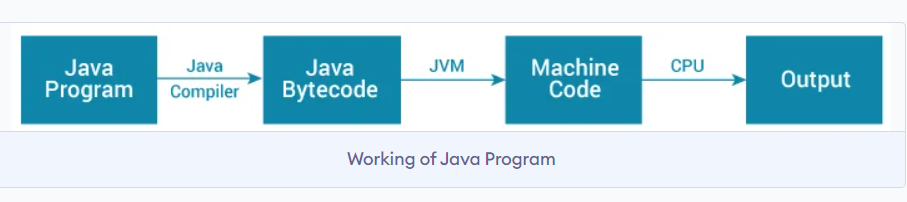

What is ```JRE```
```
JRE (Java Runtime Environment) is a software package that provides 
Java class libraries, Java Virtual Machine (JVM), 
and other components that are required to run Java applications.
```
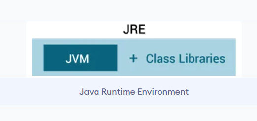

What is ```JDK```
```
JDK (Java Development Kit) is a software development kit required to develop
 applications in Java. When you download JDK, JRE is also downloaded with it.
In addition to JRE, JDK also contains a number of development tools 
(compilers, JavaDoc, Java Debugger, etc).
```
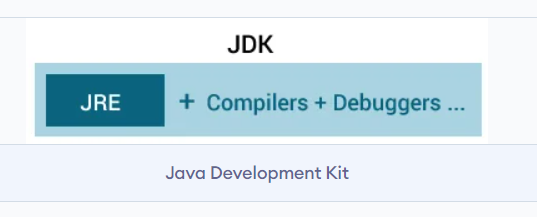

```
*Simple Program in java*


class Hello{
    public static void main(String[] args){
        System.out.println("Hello Java");

    }
}
```
***
**Java Basic Input and Output**

##java Output
```
System.out.println(); or

System.out.print(); or

System.out.printf();
```
**Difference between println(), print() and printf()**

print() - It prints string inside the quotes.

println() - It prints string inside the quotes similar like print() method. Then the cursor moves  to the beginning of the next line.

printf() - It provides string formatting (similar to printf in C/C++ programming).

```
class Print {
    public static void main(String[] args) {
    	
        System.out.println("1. println ");
        System.out.println("2. println ");
    	
        System.out.print("1. print ");
        System.out.print("2. print");
    }
}
```
 Printing Variables and Literals
```
##Print Variables

class Variables {
    public static void main(String[] args) {
    	
        Double number = -10.6;
    	
        System.out.println(5);
        System.out.println(number);
    }
}
```
**JAVA INPUT**

Java provides different ways to get input from the user. However, in this tutorial, you will learn to get input from user using the object of Scanner class.

In order to use the object of Scanner, we need to import java.util.Scanner package.
```
import java.util.Scanner;
```
Then, we need to create an object of the Scanner class. We can use the object to take input from the user.
```
// create an object of Scanner
Scanner input = new Scanner(System.in);

// take input from the user
int number = input.nextInt();
```
##Get Integer Input From the User
```
import java.util.Scanner;

class Input {
    public static void main(String[] args) {
    	
        Scanner input = new Scanner(System.in);
    	
        System.out.print("Enter an integer: ");
        int number = input.nextInt();
        System.out.println("You entered " + number);

        // closing the scanner object
        input.close();
    }
}
```
##Get float, double and String Input
```
import java.util.Scanner;

class Input {
    public static void main(String[] args) {
    	
        Scanner input = new Scanner(System.in);
    	
        // Getting float input
        System.out.print("Enter float: ");
        float myFloat = input.nextFloat();
        System.out.println("Float entered = " + myFloat);
    	
        // Getting double input
        System.out.print("Enter double: ");
        double myDouble = input.nextDouble();
        System.out.println("Double entered = " + myDouble);
    	
        // Getting String input
        System.out.print("Enter text: ");
        String myString = input.next();
        System.out.println("Text entered = " + myString);
    }
}
```
***
Comments
---

In computer programming, comments are a portion of the program that are completely ignored by Java compilers. They are mainly used to help programmers to understand the code.


**Types of Comments in Java**

In Java, there are two types of comments:

single-line comment

multi-line comment

**Single-line Comment**

A single-line comment starts and ends in the same line. To write a single-line comment, we can use the // symbol. 
```
// "Hello, World!" program example
 
class Main {
    public static void main(String[] args) {    	
        // prints "Hello, World!"
        System.out.println("Hello, World!");
    }
}
```
**Multi-line Comment**

When we want to write comments in multiple lines, we can use the multi-line comment. To write multi-line comments, we can use the /*....*/ symbol. 
```
/* This is an example of  multi-line comment.
 * The program prints "Hello, World!" to the standard output.
 */

class HelloWorld {
    public static void main(String[] args) {

        System.out.println("Hello, World!");
    }
}
```

***
```Variable``` in java

A variable is a location in memory (storage area) to hold data.
```
int speedLimit = 80;
```
Here, speedLimit is a variable of int data type and we have assigned value 80 to it.

Print ```Variable```
```
int Name = "Tej";
System.out.println(Name);
```
***
```Data type``` in java

Data types specify the different sizes and values that can be stored in the variable. 
There are two types of data types in Java:

**1.Primitive data types:** The primitive data types include boolean, char, byte, short, int, long, float and double.

**2.Non-primitive data types:** The non-primitive data types include Classes, Interfaces, and Arrays.

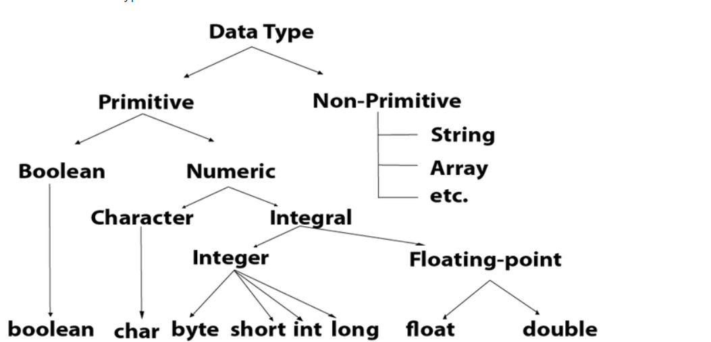
```
Data type 

    int num = 5; // store all integer number
    float f = 5.99f;  // Store all Float number
    String str = "Hello"; //Store String & Sentance 
    char ch = 'A';  // store a character
    boolean bool = true;  // Return True or false 

    System.out.println(num);
    System.out.println(f);
    System.out.println(str);
    System.out.println(bool);
    System.out.println(ch);
```
***
**Java Operators**
Operators are symbols that perform operations on variables and values. 
Operators in Java can be classified into 5 types:

**1.Arithmetic Operators**
**2.Assignment Operators**
**3.Relational Operators**
**4.Logical Operators**
**5.Unary Operators**
**6.Bitwise Operators**

|Operators|Operation|
|---|---|
| + | Addition |
| - | Subtraction|
| * | Multiplication|
| / | Division|
| % | Modulo Operation|

```
Arithmetic Operators

class Main {
  public static void main(String[] args) {
    
    // declare variables
    int a = 12, b = 5;

    // addition operator
    System.out.println("a + b = " + (a + b));

    // subtraction operator
    System.out.println("a - b = " + (a - b));

    // multiplication operator
    System.out.println("a * b = " + (a * b));

    // division operator
    System.out.println("a / b = " + (a / b));

    // modulo operator
    System.out.println("a % b = " + (a % b));
  }
}
```
**2. Java Assignment Operators**
|Operators|Example|Operation|
|---|---|---|
| = |a = b;| a = b; |
| += | a += b;|a = a + b;|
| -= | a -= b;|a = a - b;|
| *= | a *= b;|a = a * b;|
| /= | a /= b; | a = a / b;|
| %= | a %= b; | a = a % b;|
```
class Main {
  public static void main(String[] args) {
    
    // create variables
    int a = 4;
    int var;

    // assign value using =
    var = a;
    System.out.println("var using =: " + var);

    // assign value using =+
    var += a;
    System.out.println("var using +=: " + var);

    // assign value using =*
    var *= a;
    System.out.println("var using *=: " + var);
  }
}
```
**3. Java Relational Operators**
Relational operators are used to check the relationship between two operands.
|Operators|Example|Operation|
|---|---|---|
| == |Equal to| a == b; |
| != | Not Equal to|a != b;|
| > | Greater then|a > b;|
| < | Lesst= Then|a < b;|
| <= | GreaterThenequalto | a <= b;|
| >= | LessThenequalto| a >=b;|
```	

class Main {
  public static void main(String[] args) {
    
    
    int a = 7, b = 11;

    
    System.out.println("a is " + a + " and b is " + b);

    
    System.out.println(a == b);  // false

    
    System.out.println(a != b);  // true

    
    System.out.println(a > b);  // false

    
    System.out.println(a < b);  // true

    
    System.out.println(a >= b);  // false

    
    System.out.println(a <= b);  // true
  }
}
```

**4. Java Logical Operators**
Logical operators are used to check whether an expression is true or false. They are used in decision making.

|Operators|Example|Operation|
|---|---|---|
| && (Logical AND)|expression1 && expression2| true only if both  are true |
| (Logical OR) | expression1 OR expression2|true if either expression1 or expression2 is true|
| ! (Logical NOT) | !expression|true if expression is false and vice versa|

```
class Main {
  public static void main(String[] args) {

    
    System.out.println((5 > 3) && (8 > 5));  // true
    System.out.println((5 > 3) && (8 < 5));  // false

    System.out.println((5 < 3) || (8 > 5));  // true
    System.out.println((5 > 3) || (8 < 5));  // true
    System.out.println((5 < 3) || (8 < 5));  // false


    System.out.println(!(5 == 3));  // true
    System.out.println(!(5 > 3));  // false
  }
}
```
***
```Conditions``` In java
---
1. Java if (if-then) Statement

The syntax of an if-then statement is:
```
if (condition) {
  // statements
}
```
if condition evaluates to true, statements are executed

if condition evaluates to false, statements are skipped

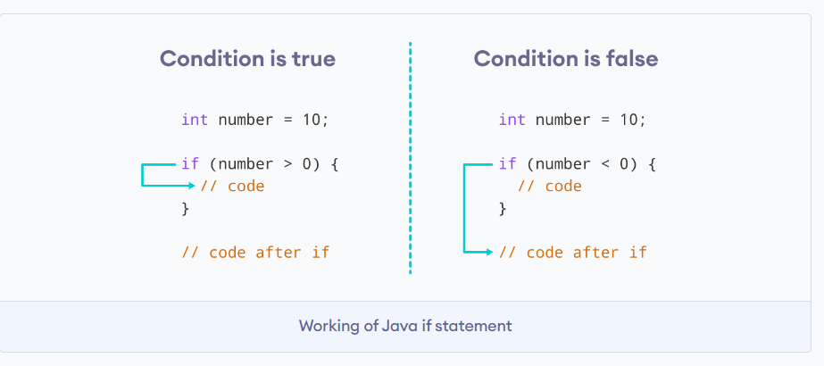

**2. Java if...else (if-then-else) Statement**

The ```if``` Statement execute When condition is true Otherwise ```Else``` part is execute 

**Syntax** of ```if-else``` statement

```
if (condition) {
  // codes in if block
}
else {
  // codes in else block
}
```
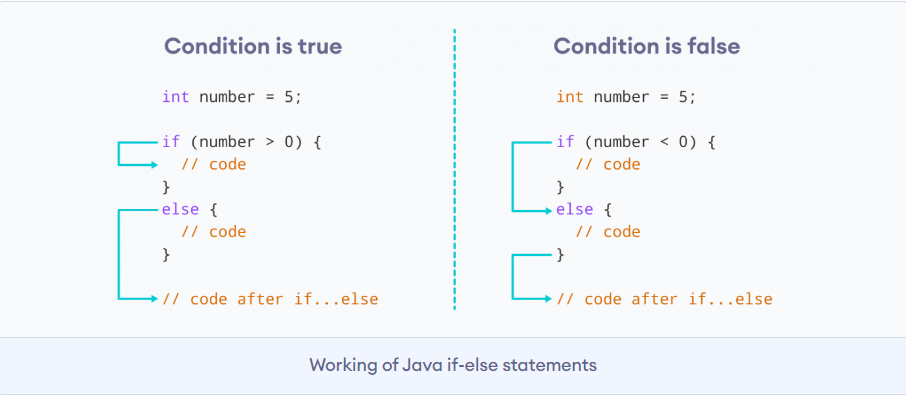

**3. Java if...else...if Statement**

In Java, we have an if...else...if ladder, that can be used to execute one block of code among multiple other blocks.
```
if (condition1) {
  // codes
}
else if(condition2) {
  // codes
}
else if (condition3) {
  // codes
}
.
.
else {
  // codes
}
```

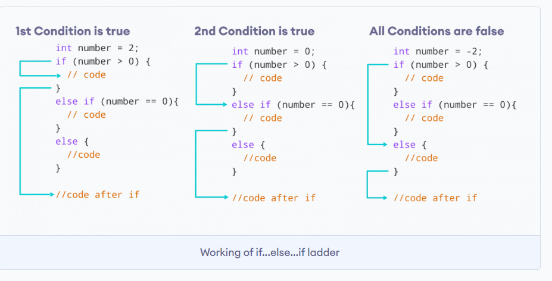

**4.Java Nested if..else Statement**

In Java, it is also possible to use if..else statements inside an if...else statement. It's called the nested if...else statement.

Here's a program to find the largest of 3 numbers using the nested if...else statement.
```
class Main {
  public static void main(String[] args) {

    // declaring double type variables
    Double n1 = -1.0, n2 = 4.5, n3 = -5.3, largest;

    // checks if n1 is greater than or equal to n2
    if (n1 >= n2) {

      // if...else statement inside the if block
      // checks if n1 is greater than or equal to n3
      if (n1 >= n3) {
        largest = n1;
      }

      else {
        largest = n3;
      }
    } else {

      // if..else statement inside else block
      // checks if n2 is greater than or equal to n3
      if (n2 >= n3) {
        largest = n2;
      }

      else {
        largest = n3;
      }
    }

    System.out.println("Largest Number: " + largest);
  }
}
```
***
Java Switch Statement
---
The ```switch``` statement allows us to execute a block of code among many alternatives.

The syntax of the switch statement in Java is:

```
switch (expression) {

  case value1:
    // code
    break;
  
  case value2:
    // code
    break;
  
  ...
  ...
  
  default:
    // default statements
  }
```
**Example: java Switch statement**

```
// Java Program to check the size
// using the switch...case statement

class Main {
  public static void main(String[] args) {

    int number = 44;
    String size;

    // switch statement to check size
    switch (number) {

      case 29:
        size = "Small";
        break;

      case 42:
        size = "Medium";
        break;

      // match the value of week
      case 44:
        size = "Large";
        break;

      case 48:
        size = "Extra Large";
        break;
      
      default:
        size = "Unknown";
        break;

    }
    System.out.println("Size: " + size);
  }
}
```
**FlowChart of Switch statement**

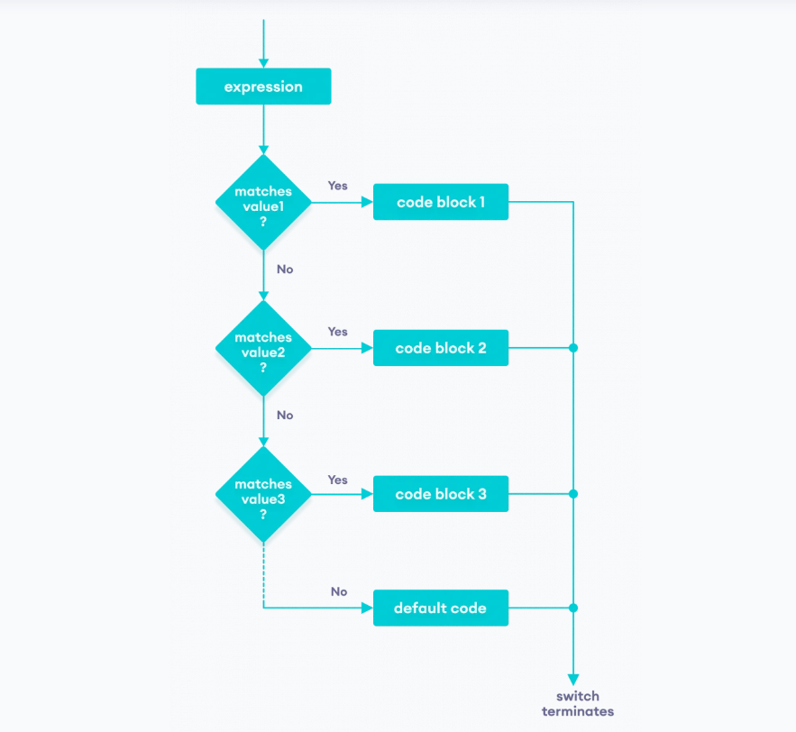
***

```Loops``` in java
---
In computer programming, loops are used to repeat a block of code. 

In Java, there are three types of loops.

1.for loop

2.while loop

3.do...while loop

***```for``` loop in java***

Java for loop is used to run a block of code for a certain number of times. The syntax of for loop is:

```
for (initialExpression; testExpression; updateExpression) {
    // body of the loop
}
```

Here,

The ```initialExpression``` initializes and/or declares variables and executes only once.

The ```condition``` is evaluated. If the ```condition``` is *true*, the body of the ``for`` loop is executed.

The ```updateExpression``` updates the value of ``initialExpression``.

The `condition` is evaluated again. The process continues until the condition is false.

***Flowchart of `for` loop***

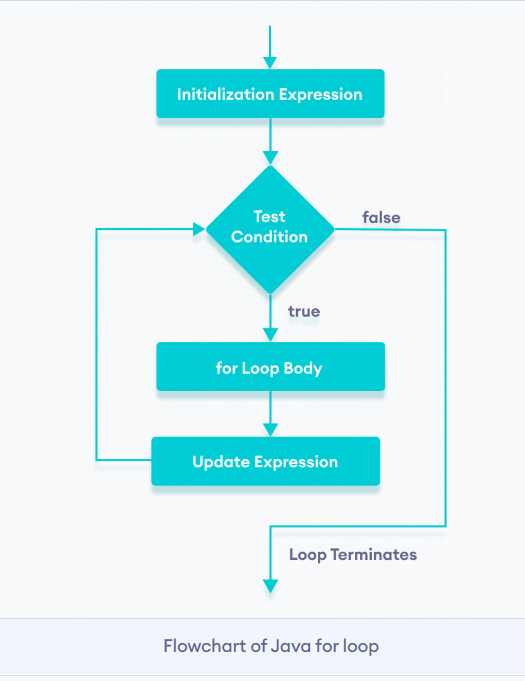

***`For-each` loop***
---

In Java, the for-each loop is used to iterate through elements of arrays and collections (like ArrayList). It is also known as the enhanced for loop.

The syntax of the Java for-each loop is:
```
for(dataType item : array) {
    ...
}
```
**array** - an array or a collection

**item** - each item of array/collection is assigned to this variable

**dataType** - the data type of the array/collection

***```While``` and ```do-while``` loop***
---

***java `while` loop***
```
while (testExpression) {
    // body of loop
}
```
A `while` loop evaluates the **textExpression** inside the parenthesis ().

If the **textExpression** evaluates to `true`, the code inside the `while` loop is executed.

The `textExpression` is evaluated again.

This process continues until the `textExpression` is `false`.

When the `textExpression` evaluates to `false`, the loop stops.

***Flow chart of `while` loop***

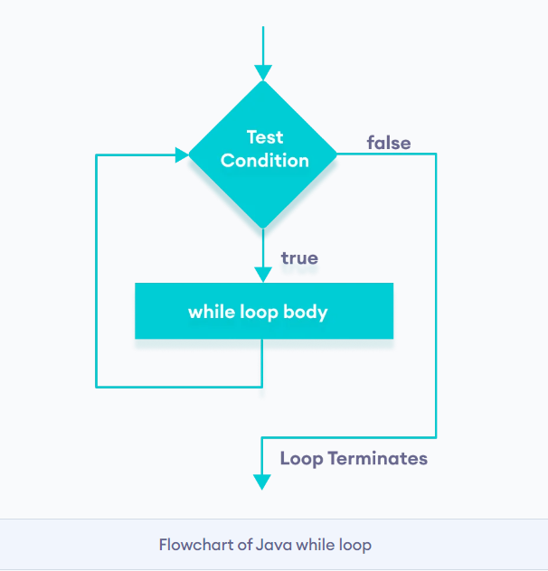

***Java `do...while` loop***

The `do...while` loop is similar to while loop. However, the body of `do...while` loop is executed once before the test expression is checked. For example,
```
do {
    // body of loop
} while(textExpression);
```
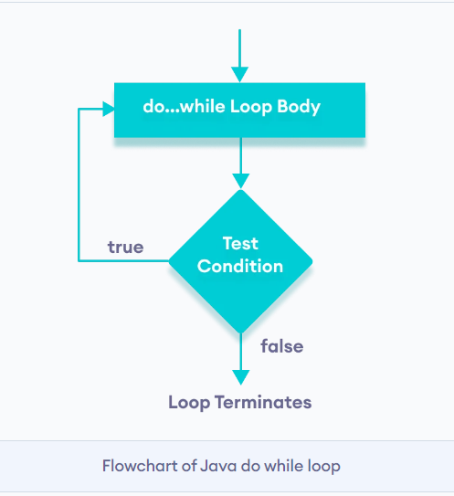

***`Break` Statement***

The `break` statement in Java terminates the loop immediately, and the control of the program moves to the next statement following the loop.

**Syntax**

```
break;
```
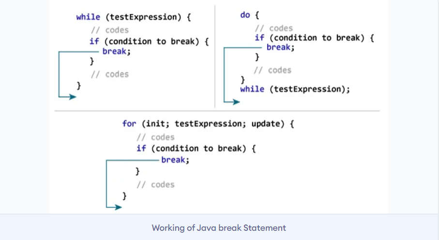

***Java `continue`***

After the `continue` statement, the program moves to the end of the loop. And, test expression is evaluated (update statement is evaluated in case of the for loop).

**Syntax**
```
continue;
```
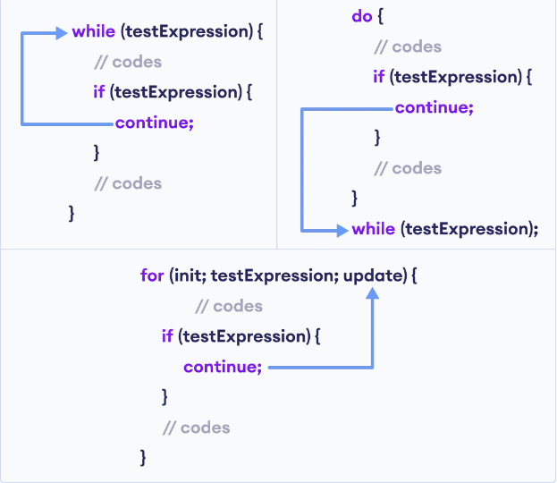
***
**`Function` in java**
---
`function` is a **block of code** , it takes some input and return some output 
**--Syntax**
```
returntype functionName(Type arg1 , type arg2)
{
//operation
}
```
**Example**
```
import java.util.*;

//create a class
public class function{

  //create a function
  public static void printMyName(String name){
    System.out.println(name);
    return;
  }
  public static void main(String[] args){
    String name = "Tej";

    //call function
    printMyName(name);
  }
}
```
***

**`Array` in java**
---
`Array` list of item of the same type.

`Array` is collection of similar datatype.


**Syntax**
```
Type[] arrayname = new type[size];
```
Start indexing at 0 to (n-1)

exple:
```
int num[] = new int[5]
n=5 
n-1 => 5-1;
0 to 4
```
print an `Array`
```
public class printArray{
  public static void main(String[] args){
    int num[] = new int[3];
    num[0] = 1;
    num[1] = 2;
    num[2] = 3;
    for(int i=0; i<=n; i++){
      System.out.println(num[i]);
    }
   }
}
```
**Get input by user in `Array`**

```
import java.util.*;
public class getInputArray{
  public static void main(String[] args){
    Scanner sc = new Scanner(System.in);
    int size = sc.nextInt();
    int number = sc.int[size];
    for(int i=0; i<size; i++){
      System.out.println(number[i]);
    }
  }
}
```

**`2D-Array` in java**

**Syntax**
```
type[][] arrayname = new type[row][col];

//creation of 2D-Array
int number[][] = new int[3][3];
```
***
**`String` in java**
---
`String` is collection of character.

**Syntax**
```
String str = "hello my name is TejPrakash Upadhyay";
```
***how to print `String`***
```
public class printString{
  public static void main(String[] args){
    String str = "Tej";
    String str1 = "Upadhyay";
    System.out.println(str);
    System.out.println(str1);
  }
} 
```
***How to get input by user as `String`***
```
import java.util.*;
public class getInput{
  public static void main(String[] args){
    Scanner sc =  new Scanner(System.in);
    String str = sc.nextLine();
    System.out.println("Your name is" + str);
  }
}

```
***`Concatention`***
```
String str = "Tej";
String str1 = "Upadhyay";
String full = str +""+str1;
System.out.print("your full Name"+full);
```
***find length any `String`***
```
varibleName.length()
```
***print one by one Character any `String`***
```
variavlename.charAt();
```


